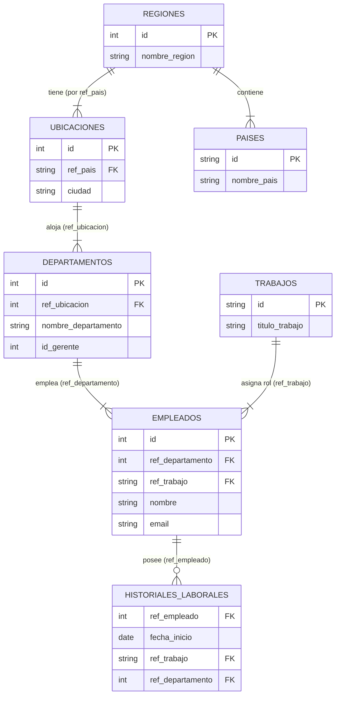

# Procesador XML de Recursos Humanos — Dashboard y Consola

Este proyecto implementa un sistema avanzado de procesamiento y base de datos XML basado en el esquema de Recursos Humanos (HR). El sistema integra herramientas de consola (CLI) y un **Dashboard Web interactivo desarrollado con Flask** que centraliza la ejecución de consultas XPath y XQuery (mediante Saxon-HE o eXist-db), la validación estricta de esquemas XSD y transformaciones XSLT.

---

##  Estructura y Árbol del Proyecto

A continuación se detalla la estructura física del workspace del proyecto:

```text
Trabajo base de dato avanzado/
├── data/                          # Datos y esquemas XML/XSD
│   ├── esquemas_hr.xml            # Archivo de datos de Recursos Humanos
│   └── esquemas_hr.xsd            # Esquema de validación XSD
├── queries/                       # Consultas XQuery y estilos XSLT
│   ├── consulta_empleados_dpto.xq # Consulta de empleados por departamento
│   ├── consulta_historial_completo.xq # Consulta de historial laboral
│   ├── consulta_salarios_dpto.xq  # Consulta de salarios por departamento
│   └── informe_salarial.xsl       # Hoja de estilo para reporte HTML
├── scripts/                       # Scripts auxiliares de consola (CLI)
│   ├── consultar_xpath.py         # Ejecución de consultas XPath
│   ├── ejecutar_xquery.py         # Consulta remota a eXist-db
│   └── validar_xml.py             # Validador de esquemas XML
├── templates/                     # Plantillas del dashboard
│   └── index.html                 # Interfaz gráfica de usuario
├── app.py                         # Servidor web Flask
├── ejecutar_app.bat               # Iniciador rápido para Windows
├── requirements.txt               # Dependencias del proyecto
└── README.md                      # Documentación principal
```

---

##  Estructura de Entidades XML

El sistema de base de datos XML modela las siguientes entidades y relaciones, imitando las llaves primarias (PK) y foráneas (FK) a través de los atributos `id` y `ref_...` para simular integridad referencial:

| Entidad XML | Elemento hijo | Atributos clave | Tipo de datos | Ocurrencias |
| :--- | :--- | :--- | :--- | :--- |
| **regiones** | `region` / `pais` | `id`, `nombre_region` | integer/string | 1..∞ |
| **ubicaciones** | `ubicacion` | `id`, `ref_pais` | integer/string | 1..∞ |
| **trabajos** | `trabajo` | `id` | string/decimal | 1..∞ |
| **departamentos** | `departamento` | `id`, `ref_ubicacion` | integer | 1..∞ |
| **empleados** | `empleado` | `id`, `ref_departamento`, `ref_trabajo` | varios | 1..∞ |
| **historiales_laborales** | `historial_laboral` | `ref_empleado` | date | 0..∞ |

### Diagrama Visual (Entidad-Relación)



---

##  CÓMO LEVANTAR LA APLICACIÓN WEB (`app.py`)

La forma principal y más sencilla de interactuar con el proyecto es iniciando el servidor web Flask en **`app.py`**. Este servidor proporciona una interfaz gráfica completa que unifica todas las utilidades de validación y consulta.

### Opción A: Ejecución rápida en Windows (Doble Clic)
El proyecto incluye un script preparado para Windows:
1. Haz doble clic sobre el archivo **`ejecutar_app.bat`** situado en la raíz del proyecto.
2. El script activará automáticamente el entorno virtual local (`.venv`) y levantará el servidor web.

### Opción B: Ejecución manual desde la consola de comandos
Abre la consola en el directorio raíz del proyecto y ejecuta los siguientes comandos:

1. **Activa el entorno virtual (.venv)**
   * **En Windows (Command Prompt / CMD):**
     ```cmd
     .venv\Scripts\activate.bat
     ```
   * **En Windows (PowerShell):**
     ```powershell
     .venv\Scripts\Activate.ps1
     ```
   * **En Linux / macOS:**
     ```bash
     source .venv/bin/activate
     ```

2. **Inicia el servidor Flask**
     ```bash
     python app.py
     ```

3. **Accede al Dashboard**
   Una vez que en la consola se indique que el servidor está activo, abre tu navegador web preferido y entra en la dirección:
    **[http://localhost:5000](http://localhost:5000)**

---

##  Configuración Inicial del Entorno (Primera vez)

Si necesitas recrear o instalar las dependencias del proyecto en un entorno local nuevo, sigue estos pasos secuenciales:

```bash
# 1. Clonar o abrir el proyecto en tu carpeta de trabajo
# 2. Crear el entorno virtual de Python
python -m venv .venv

# 3. Activar el entorno virtual (ejemplo en Windows)
.venv\Scripts\activate

# 4. Actualizar pip e instalar dependencias requeridas
pip install --upgrade pip
pip install -r requirements.txt
```

*Las dependencias principales instaladas son:*
*   `Flask`: Para el servidor web local.
*   `lxml`: Para procesamiento y validación XPath/XSLT/XSD de alta velocidad.
*   `saxonche`: Procesador oficial de Saxon-HE para ejecutar XQuery 3.1 localmente.
*   `requests`: Para la comunicación HTTP externa con eXist-db.

---

##  Características del Dashboard Web

Una vez levantado `app.py`, el panel de control te permite realizar las siguientes acciones:
*   **Editor de Consultas**: Redacta y edita libremente expresiones en XPath o XQuery.
*   **Consultas Predefinidas**: Un menú desplegable carga directamente las consultas alojadas en `/queries/` y las XPath estándar del proyecto.
*   **Doble motor XQuery**:
    *   *Saxon-HE (Local)*: Ejecuta las consultas directamente en tu máquina sin configurar nada más. Además, reescribe de forma transparente las rutas lógicas de eXist-db `/db/hr/esquemas_hr.xml` a rutas del disco local.
    *   *eXist-db (REST)*: Si tienes instalado eXist-db en el puerto `8080`, puedes ejecutar consultas directamente sobre tu servidor de base de datos XML.
*   **Transformaciones XSLT**: Permite aplicar hojas de estilos `.xsl` (como `informe_salarial.xsl`) sobre las consultas para visualizar la salida formateada en una tabla corporativa estilizada.
*   **Validación contra XSD**: Verifica al instante si el archivo `esquemas_hr.xml` cumple con el esquema XSD haciendo clic en el botón correspondiente. Mostrará un **banner de estado (verde si es válido, rojo si hay errores)**.
*   **Gestión de Empleados (Inserción Manual)**: Formulario interactivo en el panel lateral que permite agregar nuevos registros directamente al XML. Valida en tiempo real que el ID y el correo sean únicos, y que se cumplan las restricciones del esquema (como formato estándar para el correo, salarios decimales y formato de fecha estándar).

---

##  Herramientas en Línea de Comandos (CLI)

El proyecto también incluye scripts de línea de comandos si prefieres trabajar directamente desde la terminal:

### 1. Validación XML contra XSD
Valida la estructura del XML de forma local:
```bash
python scripts/validar_xml.py data/esquemas_hr.xml data/esquemas_hr.xsd
```

### 2. Ejecutar consultas XPath locales
Ejecuta las consultas XPath predefinidas desde la consola:
```bash
# Ejecutar una de las consultas XPath por su índice (del 1 al 5)
python scripts/consultar_xpath.py --consulta 1

# Ejecutar todas las consultas XPath consecutivamente
python scripts/consultar_xpath.py --todas
```

### 3. Consultas XQuery remotas en eXist-db
Ejecuta una consulta `.xq` directamente en tu servidor local de eXist-db:
```bash
python scripts/ejecutar_xquery.py queries/consulta_empleados_dpto.xq
```

### 4. API REST: Inserción Manual de Empleado (cURL)
Puedes agregar un nuevo registro enviando un JSON por POST (el servidor validará automáticamente las restricciones antes de guardar):
```bash
curl -X POST http://localhost:5000/insertar_empleado \
     -H "Content-Type: application/json" \
     -d "{\"id\": 113, \"nombre\": \"Sofía\", \"apellidos\": \"Pérez\", \"email\": \"SPEREZ\", \"telefono\": \"555.019.2831\", \"fecha_contratacion\": \"2026-05-24\", \"salario\": \"8500.00\", \"ref_departamento\": \"60\", \"ref_trabajo\": \"IT_PROG\"}"
```

---

##  Reglas estrictas de validación XSD del proyecto
El archivo `esquemas_hr.xsd` exige el cumplimiento de ciertos patrones y tipos de datos en el XML:
*   **ID de empleado**: Clave primaria numérica e incremental.
*   **Relaciones**: Los campos `ref_departamento` y `ref_trabajo` deben coincidir exactamente con los identificadores declarados en sus respectivas tablas.
*   **Email**: Debe cumplir con la expresión regular para correos estándar `[A-Za-z0-9._%+-]+@[A-Za-z0-9.-]+\.[A-Za-z]{2,}` (por ejemplo, `usuario@correo.com`).
*   **Salario**: Tipo de dato numérico decimal.
*   **Fecha de contratación**: Debe seguir estrictamente el estándar ISO `YYYY-MM-DD`.

---

## Autores
Este proyecto fue desarrollado por:
* **Brandon Elider Patiño Torres** — [elider1005](https://github.com/elider1005)
* **Santiago Patiño Torres** — [SANTPT](https://github.com/SANTPT)

